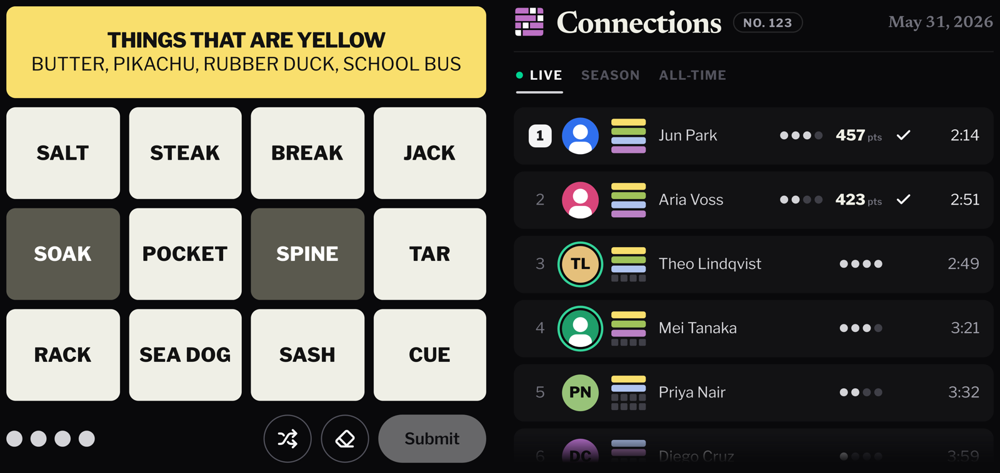

# Connections (Discord Activity)

The daily NYT Connections puzzle as a Discord Activity (the embedded GUI that opens on Play, like the Wordle activity). Shows live progress of everyone in your session and a persistent leaderboard (this season + all-time) on the end screen.



- Client: Vite + React + TypeScript + Tailwind v4
- API: Vercel serverless functions for OAuth token exchange and the NYT puzzle proxy
- Realtime + storage: Supabase Presence for live progress, Postgres for the leaderboard
- Also runs standalone in a plain browser (skips Discord/Supabase) for UI dev

```
src/        client: main.tsx (bootstrap), App.tsx (state/wiring), components.tsx +
            board.tsx (game UI), game.ts (model), roster.tsx + season.tsx (players
            panel / standings), presence.ts, leaderboard.ts, card-draw.ts (Discord
            card renderer), preview.tsx (screenshot harness)
api/        Vercel functions: puzzle.ts (NYT proxy), token.ts (OAuth), score.ts +
            guess.ts + start.ts (server-authoritative scoring), roster.ts,
            cron-recap.ts + interactions.ts (daily recap bot)
supabase/   schema.sql (tables + leaderboard functions, run once),
            recap-cron.sql (optional pg_cron trigger)
scripts/    one-off Discord setup/inspection helpers (npm run register-commands, …)
index.html  vite.config.ts  tsconfig.json  package.json
```

One `package.json`, one `node_modules`. No server to run: Vercel hosts the
static client + functions, Supabase handles realtime/DB.

## Requirements

- Node 22 (pinned via `.node-version`; run `fnm use`)
- A Discord application with Activities enabled
- Accounts on [Vercel](https://vercel.com) and [Supabase](https://supabase.com)

## 1. Supabase (live progress + leaderboard)

1. Create a project at [supabase.com](https://supabase.com).
2. SQL Editor → New query → paste `supabase/schema.sql` → Run. Presence
   needs no table; this creates the `scores` table, the leaderboard functions
   (`room_board` / `room_self` / `current_streak`), the daily-recap tables
   (`recap_channels` / `recap_posts`) and its `day_results` function, and
   policies. It's idempotent: re-run it after pulling scoring changes to pick up
   new columns and functions.
3. Project Settings → API → copy the Project URL, the anon public
   key, the service_role key (secret, server only), and the JWT Secret
   (Settings → API → JWT Settings). The last two power server-side scoring and
   authenticated presence.

## 2. Configure

```bash
fnm use
npm install
cp .env.example .env
```

Fill in `.env`:
- `VITE_DISCORD_CLIENT_ID`: your app ID (Developer Portal → General Information)
- `DISCORD_CLIENT_SECRET`: Developer Portal → OAuth2 → Client Secret
- `VITE_SUPABASE_URL` / `VITE_SUPABASE_ANON_KEY`: from step 1 (the anon key is
  read-only; it can't write the leaderboard)
- `SUPABASE_SERVICE_ROLE_KEY`: from step 1. Server-only secret that lets
  `/api/score` write verified rows. Never `VITE_`-prefixed (would ship to the browser).
- `SUPABASE_JWT_SECRET`: from step 1. Signs the short-lived Realtime JWTs that
  gate live presence to verified users.
- `SESSION_SECRET`: any long random string. HMAC key for the signed game session
  that anchors solve timing. Generate e.g. `openssl rand -base64 32`.

The next three are only needed for the `/connections` launch command and the
daily recap (section 5); leave them blank to ship just the Activity:
- `DISCORD_BOT_TOKEN`: Developer Portal → Bot → Reset Token.
- `DISCORD_PUBLIC_KEY`: Developer Portal → General Information → Public Key.
- `CRON_SECRET`: any long random string; guards the recap cron. `openssl rand -base64 32`.

## 3. Run locally

```bash
npm i -g vercel     # one-time
vercel dev          # serves the client + /api functions together
```

Open the printed URL. Two browser tabs with `?room=test` on the end share live
progress, so you can watch multiplayer work without Discord.

### Tests

```bash
npm test            # vitest run (one-shot); npm run test:watch to iterate
npm run typecheck   # tsc --noEmit
```

Covers the parts that must be correct: the pure `Game` model (`game.ts`: submit
outcomes, loss back-fill, the score formula, share grid), roster ranking
(`roster.tsx`), the HMAC session signing (`api/_session.ts`, the anti-cheat that
binds a score to a server-timed session), and the leaderboard SQL itself.
`src/sql.test.ts` loads the real `current_streak` / `room_board` / `room_self`
function bodies out of `supabase/schema.sql` and runs them in an in-process
Postgres ([PGlite](https://pglite.dev), WASM), so the streak/aggregation logic
is actually executed, not just reviewed. The UI is verified separately via the
screenshot harness (`preview.html` + `src/preview.tsx`).

## 4. Deploy to Vercel

1. Push the repo to GitHub.
2. [vercel.com](https://vercel.com) → Add New → Project → import the repo.
   Vercel auto-detects Vite + the `api/` functions, no config needed.
3. Settings → Environment Variables → add everything from your `.env`
   (`VITE_DISCORD_CLIENT_ID`, `DISCORD_CLIENT_SECRET`, `VITE_SUPABASE_URL`,
   `VITE_SUPABASE_ANON_KEY`, `SUPABASE_SERVICE_ROLE_KEY`, `SUPABASE_JWT_SECRET`,
   `SESSION_SECRET`, and — if you want section 5 — `DISCORD_BOT_TOKEN`,
   `DISCORD_PUBLIC_KEY`, `CRON_SECRET`). The `VITE_*` ones are needed at build
   time; the rest are server-only secrets (no `VITE_` prefix, so they never reach
   the browser). Optionally set `VITE_RP_ICON_URL` to
   `https://<project>.vercel.app/connections-icon.png` so the Rich Presence
   profile card gets its large image. `vercel.json` registers the daily recap
   cron automatically.
4. Deploy → copy your `https://<project>.vercel.app` URL.
5. Discord Portal → Activities → URL Mappings → `/` → that host (no `https://`).
   Set once.

## 5. Launch command + daily recap (optional bot)

Adds a `/connections` command that launches the Activity and, on the midnight-ET
reset, a recap of yesterday's results + season standings — with a Play button —
posted to the channel each server last played in. This is how the Wordle activity
behaves. It needs a real bot (the Activity install alone can't post messages), so
it's optional; skip it to ship just the game.

After deploying section 4 with `DISCORD_BOT_TOKEN`, `DISCORD_PUBLIC_KEY`, and
`CRON_SECRET` set:

1. Developer Portal → **Bot** → add a bot user, copy its token into
   `DISCORD_BOT_TOKEN` (local `.env` and Vercel).
2. Developer Portal → **Installation** (or OAuth2 → URL Generator) → add the
   `bot` scope with the **Send Messages** + **View Channel** permissions, and
   re-invite the app to your server with that link. (The Activity install doesn't
   grant message permissions.)
3. Developer Portal → **General Information** → set **Interactions Endpoint URL**
   to `https://<project>.vercel.app/api/interactions` and save. Discord sends a
   signed PING; it only saves if `DISCORD_PUBLIC_KEY` is deployed and correct.
4. Rename the auto-created Entry Point command so it's `/connections`:
   ```bash
   npm run register-commands   # uses VITE_DISCORD_CLIENT_ID + DISCORD_BOT_TOKEN from .env
   ```
5. Play a game in a server once (this records that channel as the recap target).
   The cron (`vercel.json`, daily at 06:00 UTC — just after the ET reset) then
   posts the recap there. Recaps are guild-only: a bot can't post to a group DM.

## How multiplayer works

- Identity comes from the Discord SDK (`identify` scope); standalone falls back to a guest.
- Live progress: everyone in the same activity launch shares a Discord
  `instanceId`. The client joins a Supabase Realtime Presence channel keyed by
  that ID and broadcasts `{name, mistakesLeft, solvedCount, done}`, so the
  Players panel updates live. No server, no table.
- Scoring & leaderboards: each finish produces a single transferable
  `score` (`game.ts` → `Game.score`). A win rewards completion plus a flat solve
  bonus, with mistakes and speed trading off; a loss earns convex partial credit
  for groups reached (so finishing is worth far more than getting 2/4). On finish
  the server writes one row to `scores` (first finish per puzzle wins, so replays
  can't farm it). The end screen then shows where you stand in the room: a
  leaderboard with two tabs, This season (the month) and All-time, each
  ranking players by cumulative score with streak / won-of-played / avg-mistakes,
  your own row highlighted when it places. Both come off the same table via the `room_board` /
  `room_self` Postgres functions (windowed by a `since` date; `null` = all-time).
  A "room" is the Discord guild in a server, or the channel in a DM / group chat
  (which have no guild), so the standing persists across activity launches. Only
  the official daily counts toward it. Live in-session progress is a separate
  surface, the Roster (Supabase Presence), no table.

## Notes

Personal/educational. Puzzle data is © The New York Times via their public
endpoint; don't use commercially or against their
[Terms](https://www.nytimes.com/content/help/rights/terms/terms-of-service.html).
"Connections" and its puzzle artwork are NYT trademarks (the in-app icon in
`src/assets/` derives from them) — this project is not affiliated with or
endorsed by The New York Times.

If you fork and deploy your own instance:
- Replace the contact address in `public/privacy.html` and `public/terms.html`
  with your own — you are the data controller for your deployment.
- `DISCORD_SETUP.md` and `supabase/recap-cron.sql` use `your-project.vercel.app`
  placeholders; substitute your real production host.

Fonts: [Libre Franklin](https://fonts.google.com/specimen/Libre+Franklin) and
[Newsreader](https://fonts.google.com/specimen/Newsreader) are bundled under the
[SIL Open Font License 1.1](https://openfontlicense.org).

Leaderboard integrity. Scores are server-authoritative: `/api/score` resolves
the player's identity from their Discord token (`/users/@me`), replays the
submitted guesses against the real solution to derive the outcome, measures solve
time from a signed start session, computes the score itself, and writes with the
service-role key. The browser's anon key is read-only (RLS blocks all writes), so
the leaderboard can't be forged, and live presence is gated to verified users via
short-lived Supabase JWTs. The one thing that's not preventable, because the
puzzle is rendered client-side and the answers are published by NYT anyway, is a
determined player looking up the answers to post a clean solve; but it's tied to
their real identity and real (server-measured) time. Closing even that would need
fully server-authoritative play (validate every guess, never send answers), which
isn't worth the per-guess latency for a public puzzle.

## Contributing

PRs welcome. Before opening one: `npm test && npm run typecheck` (CI runs both
plus a build). UI changes can be eyeballed without any backend via the
screenshot harness — `npx vite`, then open `/preview.html` (hash filters like
`#won`, `#lost`, `#progress` isolate a state).

## License

[MIT](LICENSE). Bundled fonts are OFL-licensed; NYT trademarks and puzzle
content remain NYT's (see Notes above).
